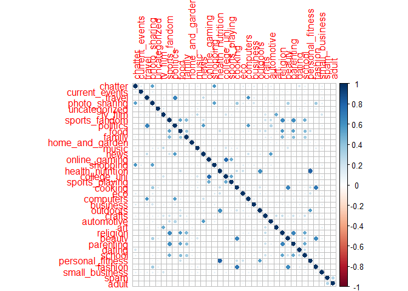
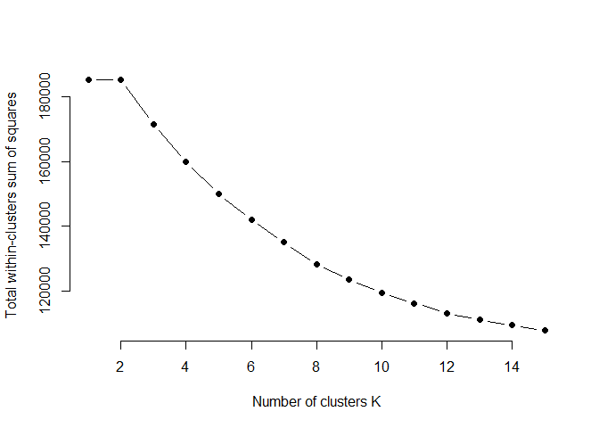

Market Segmentation
-------------------

### **Problem**

Consider the data in social\_marketing.csv. This was data collected in
the course of a market-research study using followers of the Twitter
account of a large consumer brand that shall remain nameless—let’s call
it “NutrientH20” just to have a label. The goal here was for NutrientH20
to understand its social-media audience a little bit better, so that it
could hone its messaging a little more sharply.

Your task to is analyze this data as you see fit, and to prepare a
concise report for NutrientH20 that identifies any interesting market
segments that appear to stand out in their social-media audience. You
have complete freedom in deciding how to pre-process the data and how to
define “market segment.” (Is it a group of correlated interests? A
cluster? A latent factor? Etc.) Just use the data to come up with some
interesting, well-supported insights about the audience, and be clear
about what you did.

**Market segmentation**
-----------------------

### **Problem**

The data collected in the course of a market-research study using
followers of the Twitter account of a large consumer brand that shall
remain nameless—let’s call it “NutrientH20” just to have a label. The
goal here was for NutrientH20 to understand its social-media audience a
little bit better, so that it could hone its messaging a little more
sharply. Each row of the data represents one user, labeled by a random
(anonymous, unique) 9-digit alphanumeric code. Each column represents an
interest, which are labeled along the top of the data file. The entries
are the number of posts by a given user that fell into the given
category.

> The task is to analyze this data as you see fit, and to prepare a
> concise report for NutrientH20 that identifies any interesting market
> segments that appear to stand out in their social-media audience.

### **Steps taken**

-   K-means with the raw data
-   K-means with k-means++ initialization
-   K-means with k-means++ initialization using PCA data
-   Hierarchial clustering using PCA data

> Note: I have tried different number of clusters and variables and
> decided to use five clusters and have removed five variables including
> spam, chatter and adult

#### **Correlation plot**

A lot of variables are correlated with each other. For instance,
personal fitness and health nutrition are highly correlated. Also,
online gaming and college university variables have a high correlation.
Let’s use PCA to reduce the dimensions to create fewer number of
uncorrelated variables.

#### **Principal Component Analysis**

    cumsum(pca_var1)[10]

    ## [1] 0.6337156

At 10th PC, around 63.37% of the variation is explained. According to
Kaiser criterion, we should drop all the principal components with eigen
values less than 1.0. Hence, let’s pick 10 principal components.

#### **K-Means**

It is difficult to find the number of clusters from the plot as the
within SS decreases with number of clusters. With a lot of trial and
error, I have decided to use 5 cluster since it is easier to intrepret
and identify market segments. Let’s also look at the where our points
are using 5 clusters.

#### **Cluster visualization**

The clusters look well separated. Let’s identify the characteristics of
the clusters.

#### **Results**

**Market segments identified** 1. Sports Fandom, Travel, Cooking 2.
Crafts, Current Events 3. TV Film, Automotive, Politics 4. Cooking,
Personal Fitness, Food, Shopping, Fashion 5. Travel, Outdoors, Business

Based on the K-Means clustering, we can identify distinct market
segments that NutrientH20 can potentially leverage to design specific
marketing campaigns. For example, Cluster 4 - “Cooking, Personal
Fitness, Food, Shopping, Fashion” and Cluster 5 - “Travel, Outdoors,
Business” differ vastly in terms of interests. Cluster 5 consists mainly
of people who love travelling and people in Cluster 4 are more focused
on personal grooming. Furthermore,Cluster in 1 is primarily composed of
people who have a penchant for sports, travel and cooking. In contrast,
cluster 2 has people who are artistic (they prefer crafts!). Cluster 3
seems like people with eclectic interests - starting from movies to
automotive to politics and religion as well!

#### **Hierarchial Clustering**

#### **Results**

**Market segments identified:** 1. Cooking, Personal Fitness 2. Art, TV
Film, Shopping 3. Politics, Travel, Computers 4. College Universities,
Online Gaming, News 5. Religion, Food, Parenting, School, Family

Hierarchial Clustering reveals some interesting segments that differ by
demographics. Intuitively, Cluster 4 - “College Universities, Online
Gaming, News” will consist of a younger population as compared to
Cluster 5 - “Religion, Food, Parenting, School, Family”. NutrientH20 can
design demographic specific marketing campaigns to get the most
effective message across to their audience. Cluster 2 has a group of
people who have artsy interests - art, tv film and travel. They sure do
know how to enjoy life Cluster 3 has the computer lovers, who also have
an interest for politics and travel.

Market segementation can allow us to derive insights that will help send
the right message to the right group of people that will maximize the
profits of the company and help build better relationships with the
audience. Another point to note is that the cluster stability needs to
be tracked over time since users move in and out of segments as their
interests change.
