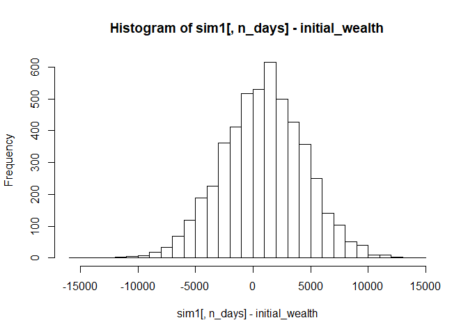
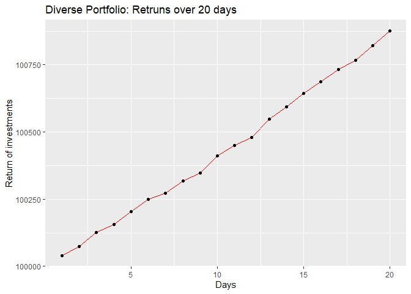

**Portfolio Modeling**
----------------------

### **Problem**

In this problem, we will construct three different portfolios of
exchange-traded funds, or ETFs, and use bootstrap resampling to analyze
the short-term tail risk of our portfolios.

We selected the ETFs ensuring diversity and different levels of risk.

The Ivesco QQQ trust is one of the largest, owns only non-financial
stocks and is tech-heavy. The stock had performed well in 2017 but had a
poor return in 2018.

SPY is one of the safest and largest ETFs around.

ProShares VIX Short-Term Futures ETF (SVXY) is a high risk ETF. This is
an unusual ETF since the performance is dependent on the market
volatility, not security.

ProShares UltraShort FTSE Europe (EPV) is a low performing ETF for the
past few years. iShares Core Growth Allocation ETF (AOR) is a very
diverse ETF.

In total, we have selected 6 ETFs - “QQQ”, “SPY”, “SVXY”, “EPV”, “AOR”
and “YYY”. We have considered 5 years of ETF data starting from
01-Jan-2014.

Sample Data for YYY

    ##            YYY.Open YYY.High  YYY.Low YYY.Close YYY.Volume YYY.Adjusted
    ## 2014-01-02 13.31214 13.31214 13.23755  13.24903      19600     13.24903
    ## 2014-01-03 13.33510 13.33510 13.17443  13.27198      15900     13.27198
    ## 2014-01-06 13.24329 13.28345 13.23181  13.28345       9800     13.28345
    ## 2014-01-07 13.28345 13.38100 13.28345  13.38100      10700     13.38100
    ## 2014-01-08 13.36952 13.36952 13.30641  13.32362      10400     13.32362
    ## 2014-01-09 13.28919 13.33510 13.28345  13.33510      13500     13.33510

Lets look at how the stocks are performing relative to each other. We
can see a strong correlation here. But it is complex and non-linear. As
discussed above, a few are performing well, others are not.

Volatility of the ETFs across the 5 year period.

Our initial wealth is $100,000

SIMULATION 1 : SAFE Portfolio

ETFs: “QQQ”, “SPY”, “SVXY”, “EPV”, “AOR”, “YYY”

For the safe portfolio, we distributed 90% of the total wealth among the
high performing ETFs - QQQ, SPY and AOR.

    ## Confidence Interval from Bootstrap Distribution (5000 replicates)

    ## 
    ## Average return of investement after 20 days 100916

    ## 
    ## 5% Value at Risk for safe portfolio- -5058.208

SIMULATION 2 : HIGH RISK PORTFOLIO

For the high risk portfolio, we distributed 90% of the total wealth
among the low performing ETFs - SVXY, EPV and YYY.

Average return of investement after 20 days - $100724.3  
5% Value at Risk for safe portfolio - $7850.127

    ## Confidence Interval from Bootstrap Distribution (5000 replicates)

    ## 
    ## Average return of investement after 20 days 100697.1

    ## 
    ## 5% Value at Risk for High portfolio- -7295.223

SIMULATION 3 - With equal weights for high risk and low risk

    ## Confidence Interval from Bootstrap Distribution (5000 replicates)

    ## 
    ## Average return of investement after 20 days 100875.3

    ## 
    ## 5% Value at Risk for High portfolio- -5880.631

#### **Summary**

For the safe portfolio, we are observing the maximum return of
investment and the lowest 5% VaR. As the portfolio risk increases, we
are able to witness the decrease in returns and increase in VaR value as
expected.

References:
<a href="https://www.bankrate.com/investing/best-etfs/" class="uri">https://www.bankrate.com/investing/best-etfs/</a>
<a href="https://etfdb.com/compare/lowest-ytd-returns/" class="uri">https://etfdb.com/compare/lowest-ytd-returns/</a>
